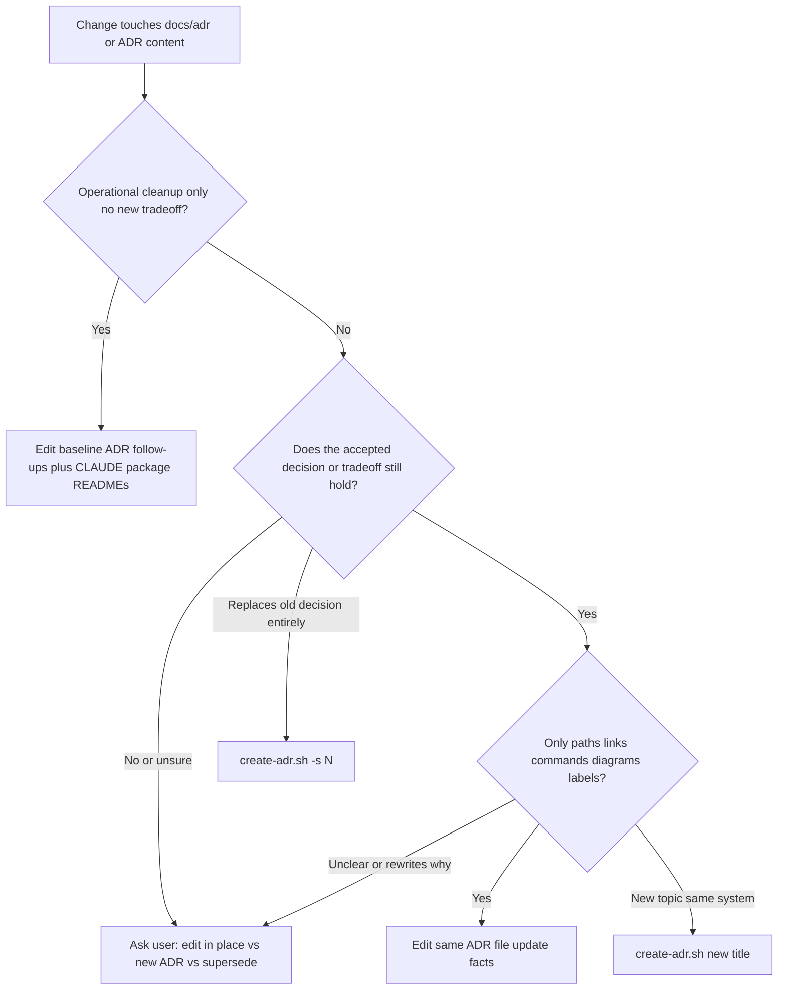

# Manage Architecture Decision Records (ADRs)

Architecture Decision Records (ADRs) are a lightweight way to document the **why** behind significant technical choices. For **AI coding agents**, ADRs are high-value only when they stay **accurate and concise**: outdated paths or duplicated trees cause wrong edits.

## When to Use

- When making a significant architectural change.
- When choosing between multiple technical approaches.
- When standardizing a pattern across the codebase.
- When **operational facts** in an accepted ADR drift (paths, commands, links, diagram labels) but the **decision still holds**—update that ADR **in place** (see §3).
- When you want to understand previous design decisions (`adr list` / read `docs/adr/`).

## For AI coding agents

- **Precision over volume:** Prefer one short **“current truth”** paragraph plus **links** to README, code, or Flex metadata—do not paste large directory trees that will go stale.
- **Three outcomes:** (1) **Edit in place** — same accepted decision; only facts drifted. (2) **New ADR** — new architectural topic or materially new constraint. (3) **Supersede** — the old decision is **no longer valid**; chain with `adr-tools` / `-s`.
- **No checklist ADRs:** Do **not** create a **new** ADR whose **Decision** is mostly a numbered list of deleted paths, workflows, Makefile targets, or CLI flags (a “cleanup manifest”). That duplicates git history, goes stale quickly, and burns context for little durable signal.
- **Default for retirements:** Add **one short paragraph** under **Follow-ups** or **Consequences** on the ADR that already records your **stack or tooling baseline**, plus links to **`CLAUDE.md`** and relevant **root or `packages/*/README.md`** files (and **`AGENTS.md`** if the repo has it). Put the exhaustive checklist in the **PR description** if humans need it.
- **Exception:** If the user explicitly asks for a compliance or audit ADR, create it—but keep **Decision** to the _choice_ to record an audit and **link out** for inventories.
- **Do not rewrite history in place:** If the narrative of _why_ something was chosen must change honestly, use **supersede** or add a one-line **Historical note**—do not silently edit Context to pretend the past was different.
- **One source of current truth:** Avoid multiple ADRs repeating the same current layout; link to the canonical ADR or doc instead.
- **Optional hygiene line:** After a path-only pass, you may add under **Status** or at the end: `Last factual update: YYYY-MM-DD (paths/links only).`
- **Ambiguity:** If you cannot classify the change in **one sentence** as _pure factual drift_ vs _decision change_, **stop and ask the user** (see §2).

More detail: [`references/adr-concepts.md`](references/adr-concepts.md) — **Agent-oriented scope**.

### Decision flow (reference)



## Instructions

### 1. Initialization

If ADRs are not yet initialized in the project, run:

```bash
adr init docs/adr
```

This ensures records are created in `docs/adr`.

### 2. Classify the change (before creating or superseding)

- **Classify first:** Use the decision flow above. Only after classification proceed to §3, §4, or §5.
- **If unclear:** Use **AskQuestion** (or equivalent) with:
  - **(A)** Edit ADR `NNNN-…` in place (factual update only).
  - **(B)** Create a **new** ADR.
  - **(C)** **Supersede** an existing ADR (old decision invalid).
  - Include a **recommended default** and one-line rationale, then wait for the user.

### 3. Maintain or update an existing ADR (factual drift)

Use when **Status** (e.g. Accepted) is still correct and the **Decision / tradeoffs** are unchanged; only **operational accuracy** slipped.

1. Open `docs/adr/NNNN-title.md`.
2. Update **paths, links, shell examples, Mermaid labels**, and cross-references to other docs.
3. Do **not** replace the original _intent_ of Context/Decision; if that must change, go to §5 or ask the user (§2).
4. Optionally add `Last factual update: YYYY-MM-DD (paths/links only).`
5. If `docs/adr/README.md` exists and its row title or summary is wrong (rare for path-only), adjust it; regenerating the full TOC is optional (`adr generate toc`).

### 4. Creating a New ADR

Use when there is a **new** architectural decision or a **new** topic that deserves its own record (after §2).

**Gate:** If the change is **only** operational cleanup (deletes, CI, Makefile targets, flag removal) **without** a new architectural tradeoff, **do not** run `create-adr.sh`. Use §3 on the ADR that already captures your **baseline decision** (extend **Follow-ups** / **Consequences**) and update **`CLAUDE.md`** and relevant READMEs.

Non-interactive creation:

```bash
REPO="$(git rev-parse --show-toplevel)"
"$REPO/.claude/skills/manage-adr/scripts/create-adr.sh" "Title of the ADR"
```

The script prints the new filename. **MUST** edit the file: Context, Decision, Consequences. See `assets/template.md` and `references/adr-concepts.md`.

### 5. Superseding an ADR

Use when a **new decision replaces** an old one (the old choice is no longer valid).

```bash
REPO="$(git rev-parse --show-toplevel)"
"$REPO/.claude/skills/manage-adr/scripts/create-adr.sh" -s <old-adr-number> "New Decision Title"
```

Complete status/link updates per adr-tools conventions on the superseded file.

### 6. Linking ADRs

To link two existing ADRs (e.g. ADR 12 amends ADR 10):

```bash
adr link 12 Amends 10 "Amended by"
```

### 7. Listing and Viewing

- List all ADRs: `adr list`
- Read a specific ADR: `read_file docs/adr/NNNN-title.md`

### 8. Generating Reports

- Table of Contents: `adr generate toc`
- Dependency graph (requires Graphviz): `adr generate graph | dot -Tpng -o adr-graph.png`

## Best Practices

- Keep ADRs focused on a **single** decision.
- Write for maintainers and agents who need **current** pointers—**link** instead of duplicating volatile lists.
- After renames (e.g. directory moves), **patch ADRs that cite old paths** (§3) unless the team explicitly wants a separate audit ADR that links back.
- Update **status and links** when decisions change (supersede flow).
- Refer to [`references/adr-concepts.md`](references/adr-concepts.md) for Nygard format and **immutability vs factual maintenance**.
- Use [`assets/template.md`](assets/template.md) as a guide.
- Use Mermaid for architecture or sequence views when it clarifies the decision.
